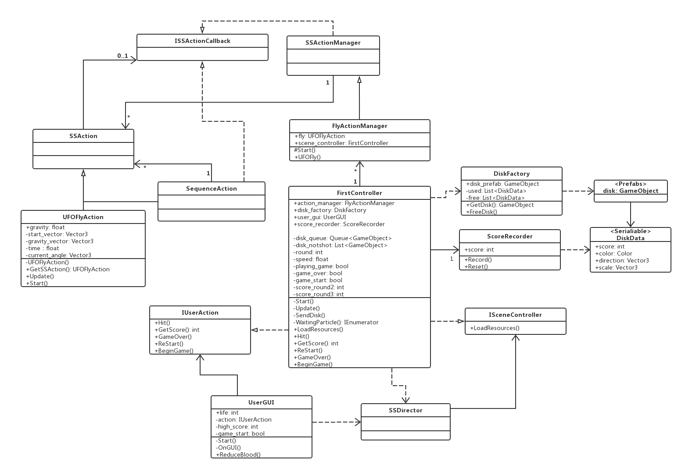

# 第五次作业————打飞碟

游戏视频[传送门](https://www.bilibili.com/video/av70690386/)

注：游戏制造过程高度借鉴优秀博客[Unity3d学习之路-简单打飞碟小游戏](https://blog.csdn.net/c486c/article/details/79952255)

## 制造过程：

### 1. 游戏制造需求：
	- 游戏内容要求：
		1. 游戏有 n 个 round，每个 round 都包括10 次 trial；
		2. 每个 trial 的飞碟的色彩、大小、发射位置、速度、角度、同时出现的个数都可能不同。它们由该 round 的 ruler 控制；
		3. 每个 trial 的飞碟有随机性，总体难度随 round 上升；
		4. 鼠标点中得分，得分规则按色彩、大小、速度不同计算，规则可自由设定。
	- 游戏的要求：
		- 使用带缓存的工厂模式管理不同飞碟的生产与回收，该工厂必须是场景单实例的！具体实现见参考资源 Singleton 模板类
		- 尽可能使用前面 MVC 结构实现人机交互与游戏模型分离

### 2. 根据uml图构造游戏代码结构：
uml图如下：

使用了MVC结构和单例模式

### 3. 代码编写
代码高度借鉴优秀博客，只在某些地方有一定的更改。
更改原因：
	游戏的需求进行了一定的改变，需要代码的控制部分有一定的改变。

更改之处：
1. 游戏更改为有n轮，每轮发送10个飞碟，
2. 共有6条命，每次miss一个飞碟生命减1
3. 飞碟大小预设了5个大小，分数从易到难分别是1，2，3，4，5，出现的概率分别是也依次由大到小。
4. 飞碟颜色完全随机。

详见代码。
