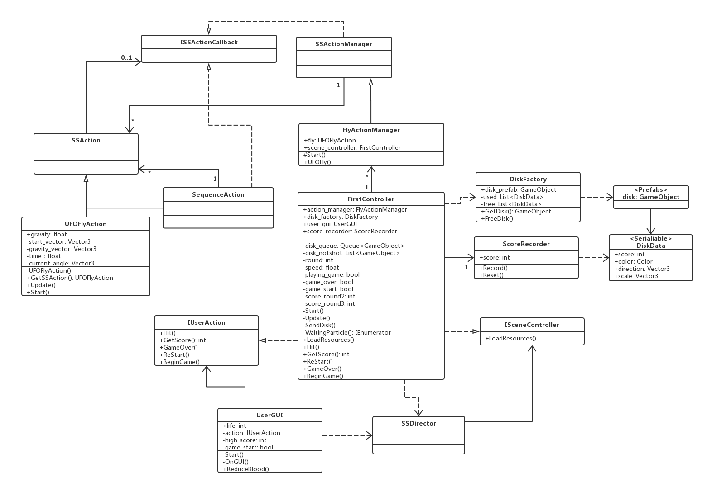

# 第六次作业————打飞碟改进版

游戏视频[传送门](https://www.bilibili.com/video/av71640552/)

注：游戏制造过程高度借鉴优秀博客
1. [Unity3d学习之路-简单打飞碟小游戏](https://blog.csdn.net/c486c/article/details/79952255)
2. [Unity3d学习之路-简单打飞碟(适配器模式)](https://blog.csdn.net/C486C/article/details/80052862)

## 制造过程：

### 1. 游戏制造需求：
- 游戏内容要求：
	1. 游戏有 n 个 round，每个 round 都包括10 次 trial；
	2. 每个 trial 的飞碟的色彩、大小、发射位置、速度、角度、同时出现的个数都可能不同。它们由该 round 的 ruler 控制；
	3. 每个 trial 的飞碟有随机性，总体难度随 round 上升；
	4. 鼠标点中得分，得分规则按色彩、大小、速度不同计算，规则可自由设定。
- 游戏的要求：
	- 使用带缓存的工厂模式管理不同飞碟的生产与回收，该工厂必须是场景单实例的！具体实现见参考资源 Singleton 模板类
	- 尽可能使用前面 MVC 结构实现人机交互与游戏模型分离

- 改进要求
   按adapter模式设计图修改之前的简单打飞碟游戏使它同时支持物理运动与运动学（变换）运动


### 2. 根据uml图构造游戏代码结构：
uml图如下：


改进版本要求的更改为：


在使用了MVC结构和单例模式的基础上，使用适配器模式将物理学变化和运动学变化统一起来，做到能够互相替换使用。

### 3. 代码编写
代码高度借鉴优秀博客，只在某些地方有一定的更改。
更改原因：
	游戏的需求进行了一定的改变，需要代码的控制部分有一定的改变。

更改之处：
1. 游戏更改为有n轮，每轮发送10个飞碟，
2. 共有6条命，每次miss一个飞碟生命减1
3. 飞碟大小预设了5个大小，分数从易到难分别是1，2，3，4，5，出现的概率分别是也依次由大到小。
4. 飞碟颜色完全随机。

新增部分的代码结果为：
1. IActionManager，作为adapter的抽象接口,场景控制器通过这个接口告诉适配器应该选择哪种实现飞碟飞行动作的方式。
```
public interface IActionManager
{
    void playDisk(GameObject disk, float angle, float power,bool isPhy);
}
```
2. ActionManagerAdapter
动作管理适配器，这个类继承了IActionManager这个接口，控制使用的运动控制方法。
```
public class ActionManagerAdapter : MonoBehaviour,IActionManager
{
    public FlyActionManager action_manager;
    public PhysisFlyActionManager phy_action_manager;
    public void playDisk(GameObject disk, float angle, float power,bool isPhy)
    {
        if(isPhy)
        {
            phy_action_manager.playDisk(disk, angle, power);
        }
        else
        {
            action_manager.playDisk(disk, angle, power);
        }
    }
    // Use this for initialization
    void Start ()
    {
        action_manager = gameObject.AddComponent<FlyActionManager>() as FlyActionManager;
        phy_action_manager = gameObject.AddComponent<PhysisFlyActionManager>() as PhysisFlyActionManager;
    }
}
```
3. PhysisFlyActionManager
物理的动作管理器，管理物理的飞碟飞行动作属性。
```
public class PhysisFlyActionManager : SSActionManager
{

    public PhysisUFOFlyAction fly;                            //飞碟飞行的动作

    protected void Start()
    {
    }
    //飞碟飞行
    public void UFOFly(GameObject disk, float angle, float power)
    {
        fly = PhysisUFOFlyAction.GetSSAction(disk.GetComponent<DiskData>().direction, angle, power);
        this.RunAction(disk, fly, this);
    }
}
```
4. PhysisUFOFlyAction
物理的飞碟飞行动作，使用Rigidbody(刚体)给飞碟添加重力和给一个初速度向量，实现飞碟飞行，注意销毁飞碟时需要把飞碟的速度设为0和不使用重力，因为飞碟并没有真正地被销毁，而是在工厂里面备用。
```
using System.Collections;
using System.Collections.Generic;
using UnityEngine;

public class PhysisUFOFlyAction : SSAction
{
    private Vector3 start_vector;                              //初速度向量
    public float power;
    private PhysisUFOFlyAction() { }
    public static PhysisUFOFlyAction GetSSAction(Vector3 direction, float angle, float power)
    {
        //初始化物体将要运动的初速度向量
        PhysisUFOFlyAction action = CreateInstance<PhysisUFOFlyAction>();
        if (direction.x == -1)
        {
            action.start_vector = Quaternion.Euler(new Vector3(0, 0, -angle)) * Vector3.left * power;
        }
        else
        {
            action.start_vector = Quaternion.Euler(new Vector3(0, 0, angle)) * Vector3.right * power;
        }
        action.power = power;
        return action;
    }

    public override void FixedUpdate()
    {
        //判断是否超出范围
        if (this.transform.position.y < -10)
        {
            gameobject.GetComponent<Rigidbody>().useGravity = false;
            gameobject.GetComponent<Rigidbody>().velocity = Vector3.zero;
            this.destroy = true;
            this.callback.SSActionEvent(this);
        }
    }
    public override void Update() { }
    public override void Start()
    {
        //使用重力以及给一个初速度
        gameobject.GetComponent<Rigidbody>().velocity = power / 10 * start_vector;
        gameobject.GetComponent<Rigidbody>().useGravity = true;
    }
}
```
5. SSActionManager
注意unity引擎的区别：
- FixedUpdate
在固定的时间间隔内执行此方法，不受游戏帧率的影响，所以处理Rigidbody的时候最好使用FixedUpdate。
- Update
在每一帧的时候调用，不同设备渲染帧的时间不同，所以每次执行Update的时候相隔的时间是不一定的。
SSActionManager调用SSAction的FixedUpdate和Update，从而实现运动学动作和物理学动作兼容。
代码略。
6. FirstController
场景控制器只需要选择使用的引擎即可。

### 剩余步骤
编写完代码后，由于代码需要使用飞碟的物理学引擎，所以需要给飞碟的预制添加刚体(Rigidbody)组件，并把飞碟碰撞器(Collider)组件，勾选isTrigger,防止多个飞碟相撞。

最后通过勾选FirstController的isPhy来实现物理和运动学的切换。
